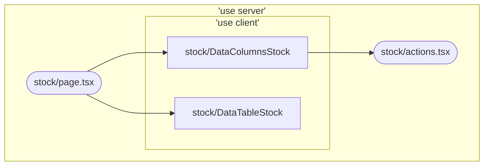

ideia inicial é fazer um data table

o formulario pra incluir stock  posusi um campo chamado product com um combo com pesquisa (Combo de pesquisa ainda nao foi feito)

O Data Table se divide em 2 componentes, um com colunas e outro é o datatable


```
└── 📁stock
    └── actions.tsx
    └── DataColumnsStock.tsx
    └── DataTableStock.tsx
    └── layout.tsx
    └── 📁new
        └── page.tsx
    └── page.tsx
    └── README.md
    └── StockForm.tsx
```




